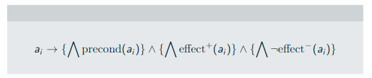
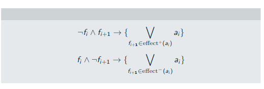

# SATPlanner
## Exécution
Simplement utiliser le script dédié :
```
./yetanothersatplanner.sh
```
Scripts pour tester rapidement :
```
./yetanothersatplanner-taquin.sh # Taquin 4x4
./yetanothersatplanner-sokoban.sh # Sokoban probème 2 avec 2 caisses
```

## Lien avec le cours
Nous avons appliqué les différentes formules comme suit :
### Etat initial 

``` java
BitVector init = problem.getInitialState();
for (int i = 0; i < nb_fluents; i++) {
    if (init.get(i)) initList.add(List.of(pair(i + 1,1)));
    else initList.add(List.of(-pair(i + 1, 1)));
}
```
### Goal

``` java
BitVector goal_pos = problem.getGoal().getPositiveFluents();
BitVector goal_neg = problem.getGoal().getNegativeFluents();

for (int i = 0; i < nb_fluents; i++) {
    if (goal_pos.get(i)) goalList.add(i + 1);
    if (goal_neg.get(i)) goalList.add(-(i + 1));
}
```
Puis le goal courant est mis à jour à chaque itération de la boucle principale :
``` java
for (Integer predicate : goalList) {
if (predicate > 0) currentGoal.add(pair(predicate, to + 1));
else currentGoal.add(-pair(-predicate, to + 1));
}
```
### Actions

``` java
List<Action> actions = problem.getActions();

for (int i = 0; i < nb_actions; i++) {
    Action a_i = actions.get(i);

    BitVector precond_ai = a_i.getPrecondition().getPositiveFluents();
    BitVector pos_ai = a_i.getUnconditionalEffect().getPositiveFluents();
    BitVector neg_ai = a_i.getUnconditionalEffect().getNegativeFluents();

    List<Integer> preconditions = new ArrayList<>();
    List<Integer> effects = new ArrayList<>();

    for (int j = 0; j < nb_fluents; j++) {

        if (precond_ai.get(j)) preconditions.add(j + 1);

        if (pos_ai.get(j)) {
                effects.add(j + 1);
                addList.computeIfAbsent(j + 1, k -> new ArrayList<>()).add(i + nb_fluents + 1);
        }

        if (neg_ai.get(j)) {
                effects.add(-(j + 1));
                delList.computeIfAbsent(j + 1, k -> new ArrayList<>()).add(i + nb_fluents + 1);
        }
    }

    actionPreconditionList.add(preconditions);
    actionEffectList.add(effects);
}
```
Puis mise à jour à chaque encodage de step :
``` java
for (int i = 0; i < nb_actions; i++) {
    int a_i = pair(i + nb_fluents + 1, step);

    for (int prec : actionPreconditionList.get(i)) {
        currentDimacs.add(List.of(-a_i, pair(prec, step)));
    }

    for (int effect : actionEffectList.get(i)) {
        if (effect >= 0) currentDimacs.add(List.of(-a_i, pair(effect, step + 1)));
        else currentDimacs.add(List.of(-a_i, -pair(-effect, step + 1)));
    }
}
```
### Actions disjunction

``` java
for (int k = i + 1; k < nb_actions; k++) { // i est l'action courante, k les actions suivantes
    actionDisjunctionList.add(List.of(i + nb_fluents + 1, k + nb_fluents + 1));
}
```
Puis à chaque encodage de step :
``` java
for (List<Integer> pair : actionDisjunctionList) {
    List<Integer> temp = new ArrayList<>();
                    
    for (int action : pair) {
        temp.add(-pair(action, step));
    }
            
    currentDimacs.add(temp);
}
```
### State transitions


A chaque encodage de step :
``` java
for (int i = 0; i < nb_fluents; i++) {

    // Equation 1
    List<Integer> negAxiom = new  ArrayList<>();
    negAxiom.add(-pair(i + 1, step));
    negAxiom.add(pair(i + 1, step+1));

    List<Integer> negativeEffects = delList.get(i + 1); 
    if(negativeEffects != null){
        for (Integer action : negativeEffects) {
            negAxiom.add(pair(action, step));
        }
    }
    currentDimacs.add(negAxiom);

    // Equation 2
    List<Integer> posAxiom = new ArrayList<>();
    posAxiom.add(pair(i + 1, step));
    posAxiom.add(-pair(i + 1, step+1));
    
    List<Integer> positiveEffects = addList.get(i + 1);
    if(positiveEffects != null){
        for (Integer action : positiveEffects) {
            posAxiom.add(pair(action, step));
        }
    }
    currentDimacs.add(posAxiom);
}
```