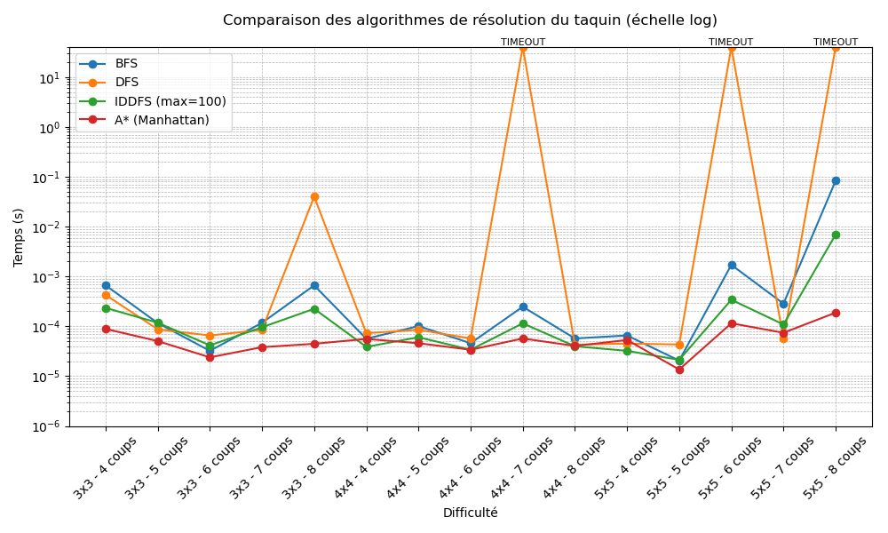

# Recherche dans un espace d’états : Taquin
## Structuration du répertoire :

- `solve_npuzzle.py` : Algorithmes de résolution du taquin : BFS, DFS, IDDFS (profondeur max 100), A* (avec heuristique de Manhattan)
- `tests/*` : Plusieurs tests classés par difficulté pour les algorithmes (facile, moyen...) (Script `launch_tests.sh`). Les fichiers utilisés pour les courbes de performances sont dans le dossier `tests/graphics/`
- `generate_graphics.py` : Script utilisé pour générer l'image des courbes de performances `courbes_algos.png` ci dessous
- `generate_npuzzle.py`, `node.py`, `npuzzle.py` : fournis
## Lancer tous les tests
Depuis ce répertoire :
```
./launch_tests.sh <bfs / dfs / astar /iddfs>
```
## Performances relatives de chaque méthode de recherche
