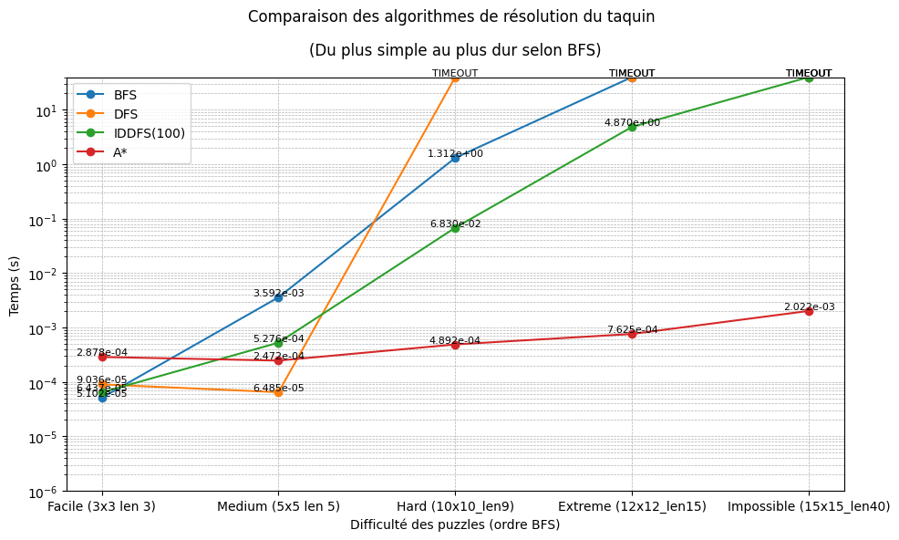

# Recherche dans un espace d’états : Taquin
## Structuration du répertoire :

- `solve_npuzzle.py` : Algorithmes de résolution du taquin (BFS, DFS, IDDFS, A*)
- `tests/*` : Plusieurs tests classés par difficulté pour les algorithmes (Script `launch_tests.sh`)
- `graphics.ipynb` : Notebook utilisé pour générer le courbes.png ci dessous
- `generate_npuzzle.py`, `node.py`, `npuzzle.py` : fournis
## Lancer tous les tests
Depuis ce répertoire :
```
./launch_tests.sh
```
## Performances relatives de chaque méthode de recherche
